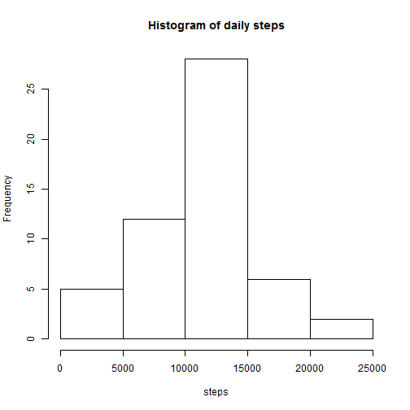
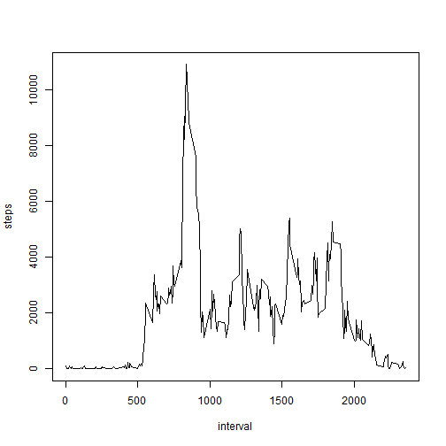
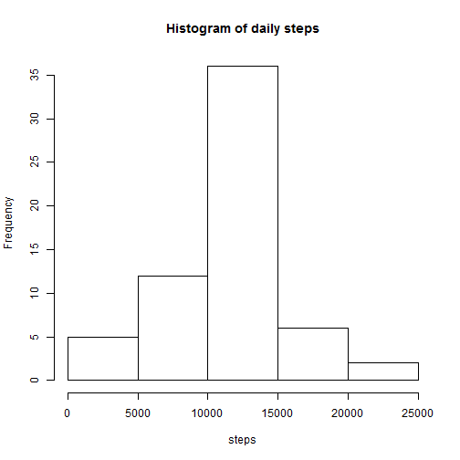

# Reproducible Research: Peer Assessment 1

## Loading and preprocessing the data
Provided file "activity.csv" is read and field "date" is converted to date format

```r
act <- read.csv(file = "activity.csv")
act$date <- as.Date(act$date)
```


## What is mean total number of steps taken per day?
For a first analysis, NA values are simply omitted and steps are summed up by date

```r
actCleaned <- na.omit(act)
dailyAct <- aggregate(actCleaned$steps, list(actCleaned$date), sum)
names(dailyAct) <- c("date", "steps")
```

A histogram is plotted and the mean and median are calculated

```r
hist(dailyAct$steps, main = "Histogram of daily steps", xlab = "steps")
```

 

```r
mean(dailyAct$steps)
```

```
## [1] 10766
```

```r
median(dailyAct$steps)
```

```
## [1] 10765
```


## What is the average daily activity pattern?
Steps are summed up by interval and plotted

```r
intervalAct <- aggregate(actCleaned$steps, list(actCleaned$interval), sum)
names(intervalAct) <- c("interval", "steps")
plot(intervalAct, type = "l")
```

 

Calculation of the interval containing the maximum number of steps

```r
intervalAct$interval[which.max(intervalAct$steps)]
```

```
## [1] 835
```


## Imputing missing values
As there are some days that contain only NAs, means are calculated over intervals. These means are merged with the original data and adjusted steps are calculated: if steps are NA, the corresponding mean is used.  

```r
means <- aggregate(actCleaned$steps, list(actCleaned$interval), mean)
names(means) <- c("interval", "mean.steps")
actAdjusted <- merge(act, means, by = "interval", all.x = T)
actAdjusted$adj.steps <- ifelse(is.na(actAdjusted$steps), actAdjusted$mean.steps, 
    actAdjusted$steps)
```

Steps are summed up again by date, a histogram is plotted and the mean and median are calculated.

```r
dailyActAdjusted <- aggregate(actAdjusted$adj.steps, list(actAdjusted$date), 
    sum)
names(dailyActAdjusted) <- c("date", "steps")
hist(dailyActAdjusted$steps, main = "Histogram of daily steps", xlab = "steps")
```

 

```r
mean(dailyActAdjusted$steps)
```

```
## [1] 10766
```

```r
median(dailyActAdjusted$steps)
```

```
## [1] 10766
```


## Are there differences in activity patterns between weekdays and weekends?
The days of the week are determined and a new field is defined which contains "weekday" or "weekend", then the mean number of steps is calculated by weekday/weekend and interval

```r
actAdjusted$weekend <- as.POSIXlt(actAdjusted$date)$wday
actAdjusted$weekend <- ifelse(actAdjusted$weekend == 0 | actAdjusted$weekend == 
    6, "Weekend", "Weekday")
actWkDayEnd <- aggregate(actAdjusted$adj.steps, list(actAdjusted$weekend, actAdjusted$interval), 
    mean)
names(actWkDayEnd) <- c("Weekend", "interval", "mean.steps")
```

A lattice plot is created which shows the differences between weekday and weekend activity

```r
library(lattice)
xyplot(mean.steps ~ interval | Weekend, data = actWkDayEnd, type = "l", layout = c(1, 
    2), ylab = "Number of steps", xlab = "Interval")
```

 


